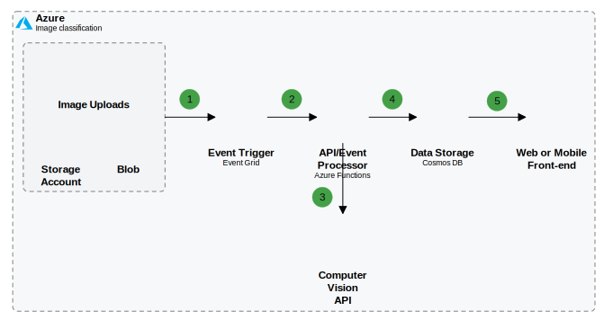

# Dependitor

[Dependitor](dependitor.com) is a Cloud Architecture diagram app focused on Azure, AWS, and GCP.

| |
|:--|
| **Figure 1:**  Example of an Azure image classification diagram created with Dependitor.
## Web App

Available at: [dependitor.com](https://dependitor.com)

### Developer Scripts

### `npm start`

Runs the app in the development mode.\
Open [http://localhost:3000](http://localhost:3000) to view it in the browser.

Do start the Azure functions and the Azure Storage Emulator first

### `npm test`

Launches the test runner in the interactive watch mode.\
See the section about [running tests](https://facebook.github.io/create-react-app/docs/running-tests) for more information.

### `npm build`

Builds the app for production to the `build` folder.\
It correctly bundles React in production mode and optimizes the build for the best performance.

The build is minified and the filenames include the hashes.\
Your app is ready to be deployed!

See the section about [deployment](https://facebook.github.io/create-react-app/docs/deployment) for more information.
